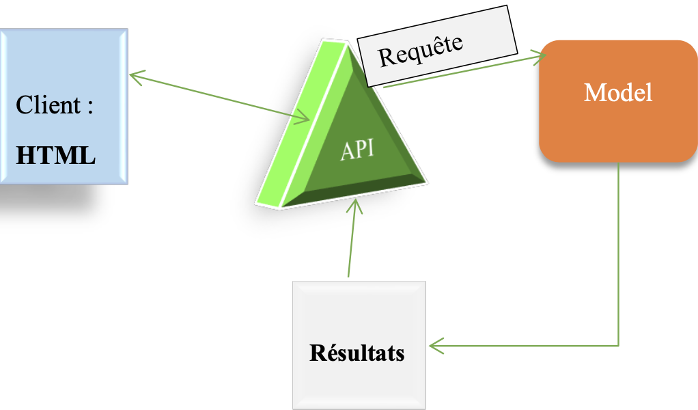

# Car_Classification_Analysis
Data analysis of a car dealership's clientele in order to to recommend vehicle models

> **[MEMBRE GROUPE 6]**
>
> DIEKE JONATHAN
>
> DOUDOU BI TOUVOLY
>
> SCHAEFFER PHILLIP

# Context and mission

Contacted by a car dealer, our mission is to help him better target the vehicles likely to interest his customers. For this it provides us with:

• its vehicle catalog (Catalogue.csv);

• its customer file containing purchases for the current year (Customers.csv - divided into 2);

• access to information on registrations made this year (Registrations.csv);

• brief documentation of the data.

At the end of this project we must propose a tool allowing:

• evaluate in real time the type of vehicle most likely to interest customers who come to the dealership;

• to send precise documentation on the most suitable vehicle for customers selected by its marketing department.

# 1- Anomaly detection and management
We have zero missing values in the row of the Catalog dataset and no anomalies.
In the registration dataset, we have no missing data but rather duplicate data. As this data is not numerous, we decide to delete it because a duplicate line does not make sense and does not give enough information.
Anomalies in Client are described in the following table:

We will impute some variables and remove others

# 2- Understanding and choice of variables

We have a perfect distribution of the number of colors in the dataset, which means that all vehicles in the catalog are represented in 5 different colors. Thus the color is not a factor of distinction of the vehicles because, for a given vehicle, we will inevitably have 5 five colors. We decide to do so, to remove color as a variable for our analysis.

We have a strong correlation between the power and price variables. This strong correlation can cause a problem for our model. Because of this, we decide to delete one of the variables. Here we choose to remove the price variable.

We notice that most vehicles are duplicates with one new and the other used. Indeed, 40% of vehicles are used, the price of used vehicles evolves in the same way as those of new cars but with a lower price.

# 3- Transformation of chosen variables
For the rest of our work, we choose the following variables:
the brand the power the length the number of places the number of doors.
In the field of machine learning, preprocessing or preprocessing in AI designates the different steps performed on the input data before they are introduced into a model. This can include cleaning the data, scaling it, and transforming it in various ways to make it fit the model better. Preprocessing can help improve the performance of a machine learning model by making the data more predictable and easier for the model to use. Here are some common preprocessing techniques:
• Normalization: This is the process of scaling the data so that it has a mean of 0 and a standard deviation of 1. This can help the model converge faster and can also improve its performance.
• Standardization: This is a process similar to normalization, but instead of scaling the data to have a standard deviation of 1, it is scaled to
5
scale to have a standard deviation of 0. This can help the model be more
robust against outliers in the data.
• One-hot Encoder: This is a technique used to encode variables
categorical as numerical data. It creates a binary vector for each category, with a 1 in the position corresponding to the category and 0s in all other positions. This can help the model better understand the data.
We thus perform the encoding of the nbPlace, nbGates, occasion and length variables and we also standardize the power variable.

# I- DATA CLUSTERING
#1- Data Visualization and Interpretation
Clustering is an unsupervised machine learning technique. It allows to categorize elements according to their similarity or resemblance. There are several algorithms clustering charts. The goal is to find similar characteristics between data and group them. Among these algorithms, we have the K-means, the agglomeration.

#1-1-K-means
K-means is an algorithm based on centroids, we choose centroids at random and we calculate the distance of the points to the centroids. Each point in the dataset is assigned to the centroid to which it is closest. This technique involves determining the number of centroids in advance. This number represents the number of clusters. However, how to choose the optimal number of clusters?
Different approaches are possible, in particular the elbow curve and the silhouette curve.
• Elbow makes it possible to determine the optimal number of clusters over a given interval. A desired cluster value interval is specified and the distance of the points with respect to the variance is calculated. A curve of the possible cluster values and the variance for each value is then drawn. The number of clusters is the part of the curve which forms a bend, that is to say the part where the value of the inertia is the smallest possible. Note that the optimal value depends on us. In general it should not be too big nor too small.

We notice that the part of the curve which forms an elbow is at k=4 and k=6. So let's try another method to get closer to the value of k that we need.
• Silhouette

The higher the score, the better. With the silhouette method, our cluster number is k = 5

# 1-2 Agglomerative cluster
It is a clustering technique, we start each point is a cluster in itself. Then, we calculate the similarity between all the points and the points with the strongest similarity are grouped together to form a cluster. Repeat the process several times until all the points are in a single cluster. This is called ascending hierarchical classification.

#1-3 Agglomerative cluster and Kmeans on the same chart

With the Elbow method and the silhouette score, Kmeans always gives us k=5. Also, Agglomerative Clustering makes us assume 5 clusters from the dendrogram but shows 6 clusters with the silhouette score.

#2- Dimension reduction and visualization

Dimension reduction is a technique for visualizing data from multiple dimensions into a smaller one. Note that this reduced dimension is a representation of the original data at a certain percentage. There are several reduction techniques, the most famous of which is PCA (Principal Component Analysis). We used PCA with K-means and Agglomerative cluster with different cluster numbers and see which cluster number is more realistic based on their distribution on the graphs. We make representations in two dimensions. These two dimensions explain 63.21% of the original data.

Visualizing in 2D after PCA-based reduction, K-Means and agglomerative clustering provide quite similar results. After analysis, we choose k=5 clusters with the k-Means model because the data are better grouped there with PCA.

# 3- Characteristics of the clusters obtained
Based on the techniques presented with 5 as the number of clusters, we present the characteristics of the different categories of vehicles obtained. For now, we have labeled categories 0,1,2,3 and 4.

**[For category 0:]**

We notice that all the vehicles of category **0** have a
**average** length, number of doors and seats equal to **5.**
The power is between **90 and 150.** In addition, we have
vehicles that are used and a representation of several
brands. In view of these different characteristics, we deduce that
these are **normal vehicles.**

**[For category 1:]**

They are very long cars whose power is between
**193 and 272.** We only have two cars that are not
second hand. We can say that these are **old vehicles.**

**[For category 2:]**

These are long vehicles with seats up to **7** and a
power between 102 and 197. They are also available in
**used** with prices proportional to the power.

We deduce
that they are **family vehicles.**

**[For category 3:]**

They are very small vehicles with a power
maximum equal to **115.** Available new and used with 3
doors most often. We can say these are cars
**city cars,** generally for one person.

**[For category 4:]**

These are cars with a minimum horsepower of 306 and ranging
up to 507. We only have 4 vehicles in this category. Their
rarity, their price and their power make us say that they are
**luxury vehicles.** In the end, we obtained 5 categories of
vehicle that are:

- normal
- old
- city cars
- families
- luxury 

**All previous work has been done without taking into account the
information in the CO2 dataset. The grouping of vehicles has
does the most on the length variable.**

# 4-Add new variables

In the following, we have added additional information about
catalog and registration data (bonus-malus, cost and
energy, rejectionco2). By proceeding as above we have the graphics
following:

# 4-1- Agglomerative cluster

We obtain a number of clusters equal to 4

# 4-2-Evolution of inertia

The inflection point in this case is 4, hence the number of cluster

# 4-3-Presentation of classes
➢Class 0

➢Class 1

➢Class 2

➢Class 3

**We note that the grouping by class was not done according to
a single variable. Previously, we had a single length per
class but this is no longer the case.**

All lengths are present in all classes. Eventually,
we will consider 4 classes of vehicles.

# II- CLASSIFICATION AND PREDICTION

After determining the vehicle categories and assigning them
labels, we will perform a classification based on these
categories.

# 1-Classification algorithms

For classification, we used two combined approaches,
the **grid search** and

the **voting classifier**. The grid search for the search for
optimal parameters and the

voting classifier for a Learning set (grouping of several
models).

# 1-1- Search for optimal parameters (grid search)

To do this, we define a class **Trainer** which takes into
entries the games of

data (train & test) and the models then trains them, displays
the scores and log them

metrics and model using **MLFLOW**.

➢Experiment 1

We used the algorithms of Logistic Regression, Random
Forest, Xgboost and KNN with accuracy and precision metrics. We
thus obtains the following results:

The random Foreste presents better results, then comes the
Xgboost.

# 1-2-Ensemble Learning (voting classifier)
We then use the optimal parameters of each model obtained
thanks to the grid search to carry out the voting classifier.

➢Experiment 2

We define each model with its optimal parameters and pass them
as input in the voting classifier. We get the following results:

We have good results but not as good as that of the random forest
only.

# 1-3-Addition of CO2 dataset information

We add the CO2 information in the catalog dataset and
of registration:

Adding new variables did not improve our score.

# 2-Api and customer page

For the use of our model, we have set up an API and
a Web page. This page is used to collect information
clients and the api sends them to our model. The result (the
prediction) of the model is then returned to our API which allows
our page to display it.

This form allows you to enter information about a vehicle. These
information is then sent to our API.

# Conclusion

In this project, we first look for the number of
clusters needed to group vehicles. We got 5
clusters at first but the grouping was done according to a
only variable, the length. We have added information
additional in our data to obtain 4 clusters with a
grouping based on several variables. Secondly, we
carried out a classification based on

on the use of several machine learning algorithms (together
Learning) to make our predictions. Finally, we implemented
an API and a web page to enter vehicle characteristics and
make our predictions based on data from

the user. For us, it was a great experience.
discover machine learning in several aspects
