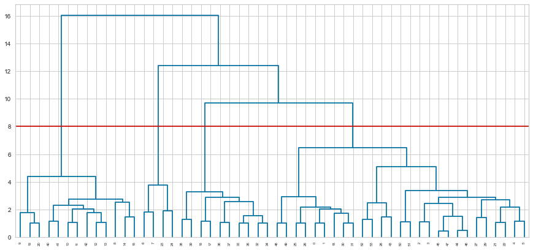

# Car_Classification_Analysis
Data analysis of a car dealership's clientele in order to to recommend vehicle models

# Contexte et mission
Contactés par un concessionnaire automobile, nous avons pour mission de l'aider à mieux cibler les véhicules susceptibles d'intéresser ses clients. Pour cela il met à notre disposition :
• son catalogue de véhicules (Catalogue.csv) ;
• son fichier clients contenant les achats de l'année en cours (Clients.csv - divisé en 2) ;
• un accès aux informations sur les immatriculations effectuées cette année
(Immatriculations.csv) ;
• une brève documentation des données.
A la fin de ce projet nous devons proposer un outil permettant :
• d’évaluer en temps réel le type de véhicule le plus susceptible d'intéresser les clients qui se présenteront dans la concession ;
• d’envoyer une documentation précise sur le véhicule le plus adéquat pour des clients sélectionnés par son service marketing.

# 1- Détection et gestion des anomalies
Nous avons zéro valeur manquante dans ligne du dataset Catalogue et pas d’anomalie.
Dans le dataset immatriculation, nous n’avons pas de données manquantes mais plutôt des données dupliquées. Comme ces données ne sont pas nombreuses, nous décidons de les supprimer car une ligne dupliquée n’a pas de sens et ne donne pas assez d’information.
Les anomalies dans Client sont décrites dans le tableau suivant :

++++++

Nous allons imputer certaines variables et supprimer d’autres

# 2- Compréhension et choix des variables

++++++

Nous une distribution parfaite du nombre de couleur dans le dataset, ce qui veut dire que tous les véhicules dans catalogue sont représentés dans 5 couleurs différentes. Ainsi la couleur n’est pas un facteur de distinction des véhicules car, pour un véhicule donné, nous aurons forcément 5 cinq couleurs. Nous décidons de se faire, de supprimer la couleur comme variable pour notre analyse.

+++

Nous avons une forte corrélation entre les variables puissance et prix. Cette forte corrélation peut causer un problème pour notre modèle. De ce fait, nous décidons de supprimer l’une des variables. Ici, nous choisissons de supprimer la variable prix.

+++

Nous remarquons que la plupart des véhicules sont en doublons avec une neuve et l’autre d’occasion. En effet, 40% des véhicules sont d’occasion, le prix des véhicules d’occasion évolue de la même façon que ceux que les voitures neuves mais avec un prix moindre.

# 3- Transformation des variables choisies
Pour la suite de nos travaux, nous choisissons les variables suivantes :
la marque la puissance la longueur le nombre de places le nombre de portes.
Dans le domaine du machine Learning, le prétraitement ou encore preprocessing en AI désigne les différentes étapes effectuées sur les données d'entrée avant qu'elles ne soient introduites dans un modèle. Il peut s'agir de nettoyer les données, de les mettre à l'échelle et de les transformer de diverses manières pour les rendre plus adaptées au modèle. Le prétraitement peut contribuer à améliorer les performances d'un modèle d'apprentissage automatique en rendant les données plus prévisibles et plus faciles à exploiter par le modèle. Voici quelques techniques de prétraitement courantes :
• La normalisation : Il s'agit du processus de mise à l'échelle des données afin qu'elles aient une moyenne de 0 et un écart type de 1. Cela peut aider le modèle à converger plus rapidement et peut également améliorer ses performances.
• Standardisation : Il s'agit d'un processus similaire à la normalisation, mais au lieu de mettre à l'échelle les données pour qu'elles aient un écart-type de 1, on les met à
5
l'échelle pour qu'elles aient un écart-type de 0. Cela peut aider le modèle à être plus
robuste face aux valeurs aberrantes des données.
• One-hot Encoder : Il s'agit d'une technique utilisée pour encoder des variables
catégorielles en tant que données numériques. Elle crée un vecteur binaire pour chaque catégorie, avec un 1 dans la position correspondant à la catégorie et des 0 dans toutes les autres positions. Cela peut aider le modèle à mieux comprendre les données.
Nous effectuons ainsi, l’encodage des variables nbPlace, nbPortes, occasion et longueur et nous faisons également la standardisation de la variable puissance.

# I- CLUSTERING DES DONNEES
# 1- Visualisation des données et interprétation
Le clustering est une technique d’apprentissage non supervisé en machine Learning. Il permet de catégoriser des éléments en fonction de leur similarité ou ressemblance. Il existe plusieurs algorithmes de clustering. Le but est de trouver les caractéristiques similaires entre données et les regrouper. Parmi ces algorithmes, nous avons le K-means, l’agglomération.
# 1-1- K-means
K-means est un algorithme basé sur les centroïdes, l’on choisit des centroïdes au hasard et on calcul la distance des points aux centroïdes. Chaque point du dataset est assigné au centroïde auquel il est le plus proche. Cette technique veut que l’on détermine le nombre de centroïdes à l’avance. Ce nombre représente le nombre de clusters. Cependant, comment choisie le nombre optimal de cluster ?
Différentes approches sont possibles notamment la courbe elbow et la courbe de silhouette.
• Elbow permet de déterminer le nombre optimal de cluster sur un intervalle donné. On précise un intervalle de valeur de cluster souhaité et on calcule la distance des points vis-à-vis de la variance. On trace ensuite une courbe des valeurs de cluster possible et de la variance pour chaque valeur. Le nombre de clusters est la partie de la courbe qui forme un coude, c’est-à-dire la partie où la valeur de l’inertie est la plus petite possible. Notons que la valeur optimale dépend de nous. En générales elle ne doit pas être trop grande ni trop petite.

++++

Nous remarquons que la partie de la courbe qui forme un coude se trouve en k=4 et k=6. Essayons donc une autre méthode pour nous rapprocher de la valeur de k qu’il faut.
• Silhouette

+++

Plus le score est grand, mieux c’est. Avec la méthode silhouette, notre nombre de cluster est k = 5

# 1-2 Agglomérative cluster
C’est une technique de clustérisation, on départ chaque point est un cluster en lui-même. Ensuite, on calcul la similarité entre tous les points et les points avec la plus forte similarité sont regroupé entre eux pour former un cluster. Répète le processus plusieurs fois jusqu’à ce que tous les points soient dans un seul cluster. On parle alors de classification hiérarchique ascendante.

++++

# 1-3 Aglomérative cluster et Kmeans sur le même graphique

++++++

Avec la méthode Elbow et le score de la silhouette, Kmeans nous fournit toujours k=5. De plus, l'Agglomerative Clustering nous fait supposer 5 clusters à partir du dendrogramme mais indique 6 clusters avec le score de la silhouette.

# 2- Réduction de dimension et visualisation

La réduction de dimension est une technique qui permet de visualiser des données de plusieurs dimensions dans une plus réduite. Notons que cette dimension réduite est une représentation des données originales à un certain pourcentage. Il existe plusieurs techniques de réduction dont la plus célèbre est le PCA (Principal Component Analysis). Nous avons utilisé PCA avec K- means et Agglomérative cluster avec des nombres de cluster différents et voir quel nombre de cluster est plus réaliste en fonction de leur repartion sur les graphique. Nous effectuons des représentations en deux dimensions. Ces deux dimensions expliquent 63.21% des données d’origines.

+++

En visualisant en 2D après une réduction basée sur PCA, le K-Means et l'agglomérative clustering fournissent des résultats assez similaires. Après analyse, nous choisissons k=5 clusters avec le modèle de k-Means car les données y sont mieux regroupées avec PCA.

# 3- Caractéristiquesdesclustersobtenus
En nous basant sur les techniques présente avec 5 comme nombre de clusters nous présentons les caractéristiques des différentes catégories de véhicules obtenus. Pour l’instant, nous avons labellisé les catégories 0,1,2,3 et 4.

+++++

Nous remarquons que tous les véhicules de la catégorie 0 ont une longueur moyenne, des nombres de portes et de places égale à 5. La puissance est comprise entre 90 et 150. De plus, nous avons des véhicules qui sont d’occasion et une représentation de plusieurs marques. Au vu de ces différentes caractéristiques, nous déduisons que ce sont des véhicules normaux.

+++
(categorie pics und text)

++++

++++++++
+++++++++++++
+++++++++++

{width="1.4291666666666667in"
height="0.4166666666666667in"}

{width="1.359721128608924in"
height="0.7152777777777778in"}

+-----------------------------------------------------------------------+
| > **Analyse de la clientèle d\'un concessionnaire automobile dans     |
| > l'objectif de pouvoir recommander des modèles de véhicules**        |
+=======================================================================+
+-----------------------------------------------------------------------+

> **[MEMBRE GROUPE 6]{.underline}**
>
> DIEKE JONATHAN
>
> DOUDOU BI TOUVOLY
>
> SCHAEFFER PHILLIP

1

INTRODUCTION

> **I-** **ANALYSE EXPLORATOIRE DES DONNEES** 1-Détection et gestion des
> anomalies\
> 2-Compréhension et choix des variables\
> 3-Transformation des variables choisies\
> **II-** **CLUSTERING DES DONNEES**\
> 1-Etude des méthodes de clustering\
> 2-Réduction de dimension et visualisation\
> 3-Caractéristiques des clusters obtenus\
> 4-Ajout de nouvelles variables\
> **III-CLASSIFICATION ET PREDICTION**\
> 1-Les algorithmes de classifications\
> 2-Api et déploiement

CONCLUSION

2

**Contexte et mission**

Contactés par un concessionnaire automobile, nous avons pour mission de
l\'aider à mieux cibler les véhicules susceptibles d\'intéresser ses
clients. Pour cela il met à notre disposition : •son catalogue de
véhicules (Catalogue.csv) ;\
•son fichier clients contenant les achats de l\'année en cours
(Clients.csv - divisé en 2) ; •un accès aux informations sur les
immatriculations effectuées cette année\
(Immatriculations.csv) ;\
•une brève documentation des données.

A la fin de ce projet nous devons proposer un outil permettant :

> •d'évaluer en temps réel le type de véhicule le plus susceptible
> d\'intéresser les clients qui se présenteront dans la concession ;\
> •d'envoyer une documentation précise sur le véhicule le plus adéquat
> pour des clients sélectionnés par son service marketing.
>
> **1-Détection et gestion des anomalies**

Nous avons zéro valeur manquante dans ligne du dataset Catalogue et pas
d'anomalie.

Dans le dataset immatriculation, nous n'avons pas de données manquantes
mais plutôt des données dupliquées. Comme ces données ne sont pas
nombreuses, nous décidons de les supprimer car une ligne dupliquée n'a
pas de sens et ne donne pas assez d'information.

Les anomalies dans Client sont décrites dans le tableau suivant :

+-----------+-----------+-----------+-----------+-----------+-----------+
| > age     | > Sexe    | > Taux    | situation | > nbEnfan | > 2eme    |
|           |           |           | Familiale | tsAcharge | > voiture |
+===========+===========+===========+===========+===========+===========+
| > 308     | > 310     | > 322     | > 306     | > 316     | > 205     |
+-----------+-----------+-----------+-----------+-----------+-----------+

Nous allons imputer certaines variables et supprimer d'autres

> **2-Compréhension et choix des variables**

{width="6.301388888888889in"
height="2.3722222222222222in"}

3

Nous une distribution parfaite du nombre de couleur dans le dataset, ce
qui veut dire que tous les véhicules dans catalogue sont représentés
dans 5 couleurs différentes. Ainsi la couleur

n'est pas un facteur de distinction des véhicules car, pour un véhicule
donné, nous aurons forcément 5 cinq couleurs. Nous décidons de se faire,
de supprimer la couleur comme variable pour notre analyse.

> {width="5.151388888888889in"
> height="3.4319444444444445in"}

Nous avons une forte corrélation entre les variables **puissance** et
**prix**. Cette forte corrélation

peut causer un problème pour notre modèle. De ce fait, nous décidons de
supprimer l'une des variables. Ici, nous choisissons de supprimer la
variable prix.

4

{width="6.301388888888889in"
height="3.261111111111111in"}

Nous remarquons que la plupart des véhicules sont en doublons avec une
neuve et l'autre d'occasion. En effet, 40% des véhicules sont
d'occasion, le prix des véhicules d'occasion évolue de la même façon que
ceux que les voitures neuves mais avec un prix moindre.

> **3-Transformation des variables choisies**

Pour la suite de nos travaux, nous choisissons les variables suivantes :

**la marquela puissancela longueurle nombre de places le nombre de
portes.**

Dans le domaine du machine Learning, le prétraitement ou encore
preprocessing en AI désigne les différentes étapes effectuées sur les
données d\'entrée avant qu\'elles ne soient introduites dans un modèle.
Il peut s\'agir de nettoyer les données, de les mettre à l\'échelle et
de les transformer de diverses manières pour les rendre plus adaptées au
modèle. Le prétraitement peut contribuer à améliorer les performances
d\'un modèle d\'apprentissage automatique en rendant les données plus
prévisibles et plus faciles à exploiter par le modèle. Voici quelques
techniques de prétraitement courantes :

> •***La normalisation*** : Il s\'agit du processus de mise à l\'échelle
> des données afin qu\'elles aient une moyenne de 0 et un écart type
> de 1. Cela peut aider le modèle à converger plus rapidement et peut
> également améliorer ses performances.
>
> •***Standardisation*** : Il s\'agit d\'un processus similaire à la
> normalisation, mais au lieu de mettre à l\'échelle les données pour
> qu\'elles aient un écart-type de 1, on les met à

5

> l\'échelle pour qu\'elles aient un écart-type de 0. Cela peut aider le
> modèle à être plus robuste face aux valeurs aberrantes des données.
>
> •***One-hot Encoder*** : Il s\'agit d\'une technique utilisée pour
> encoder des variables catégorielles en tant que données numériques.
> Elle crée un vecteur binaire pour chaque catégorie, avec un 1 dans la
> position correspondant à la catégorie et des 0 dans toutes les autres
> positions. Cela peut aider le modèle à mieux comprendre les données.
>
> Nous effectuons ainsi, l'encodage des variables **nbPlace, nbPortes,
> occasion et longueur** et nous faisons également la standardisation de
> la variable **puissance**.
>
> **I-** **CLUSTERING DES DONNEES**\
> **1-Visualisation des données et interprétation**

Le clustering est une technique d'apprentissage non supervisé en machine
Learning. Il permet de catégoriser des éléments en fonction de leur
similarité ou ressemblance. Il existe plusieurs algorithmes de
clustering. Le but est de trouver les caractéristiques similaires entre
données et les regrouper. Parmi ces algorithmes, nous avons le K-means,
l'agglomération.

**1-1-** **K-means**

K-means est un algorithme basé sur les centroïdes, l'on choisit des
centroïdes au hasard et on calcul la distance des points aux centroïdes.
Chaque point du dataset est assigné au centroïde auquel il est le plus
proche. Cette technique veut que l'on détermine le nombre de centroïdes
à l'avance. Ce nombre représente le nombre de clusters. Cependant,
comment choisie le nombre optimal de cluster ?

Différentes approches sont possibles notamment la courbe **elbow** et la
courbe de **silhouette**.

> •**Elbow** permet de déterminer le nombre optimal de cluster sur un
> intervalle donné. On précise un intervalle de valeur de cluster
> souhaité et on calcule la distance des points vis-à-vis de la
> variance. On trace ensuite une courbe des valeurs de cluster possible
> et de la variance pour chaque valeur. Le nombre de clusters est la
> partie de la courbe qui forme un coude, c'est-à-dire la partie où la
> valeur de l'inertie est la plus petite possible. Notons que la valeur
> optimale dépend de nous. En générales elle ne doit pas être trop
> grande ni trop petite.

6

{width="3.4611111111111112in"
height="1.7166666666666666in"}

> {width="3.1625in"
> height="2.0944444444444446in"}

Nous remarquons que la partie de la courbe qui forme un coude se trouve
en **k=4 et k=6.** Essayons donc une autre méthode pour nous rapprocher
de la valeur de **k** qu'il faut.

> •Silhouette
>
> {width="4.633333333333334in"
> height="3.301388888888889in"}
>
> Plus le score est **grand,** mieux c'est. Avec la méthode silhouette,
> notre nombre de cluster est k = 5\
> **1-2 Agglomérative cluster**

7

> C'est une technique de clustérisation, on départ chaque point est un
> cluster en lui-même.
>
> Ensuite, on calcul la similarité entre tous les points et les points
> avec la plus forte similarité
>
> sont regroupé entre eux pour former un cluster. Répète le processus
> plusieurs fois jusqu'à
>
> ce que tous les points soient dans un seul cluster. On parle alors de
> classification
>
> hiérarchique ascendante.

{width="5.916666666666667in"
height="2.9430555555555555in"}

> **1-3 Aglomérative cluster et Kmeans sur le même graphique**

{width="6.301388888888889in"
height="3.091666666666667in"}

Avec la méthode Elbow et le score de la silhouette, Kmeans nous fournit
toujours k=5. De plus, l\'Agglomerative Clustering nous fait supposer 5
clusters à partir du dendrogramme mais indique 6 clusters avec le score
de la silhouette.

8

> **2-Réduction de dimension et visualisation**
>
> La réduction de dimension est une technique qui permet de visualiser
> des données de plusieurs dimensions dans une plus réduite. Notons que
> cette dimension réduite est une représentation des données originales
> à un certain pourcentage. Il existe plusieurs techniques de réduction
> dont la plus célèbre est le **PCA (*Principal Component Analysis*).**
> Nous avons utilisé **PCA avec K-means et Agglomérative** cluster avec
> des nombres de cluster différents et voir quel nombre de cluster est
> plus réaliste en fonction de leur repartion sur les graphique. Nous
> effectuons des représentations en deux dimensions. Ces deux dimensions
> expliquent **63.21%** des données d'origines.
>
> {width="6.579166666666667in"
> height="1.620832239720035in"}

*Figure 1 PCA avec K-means*

> {width="6.301388888888889in"
> height="1.5527777777777778in"}
>
> *Figure 2 PCA avec agglomérative cluster*
>
> En visualisant en 2D après une réduction basée sur PCA, le K-Means et
> l\'agglomérative clustering fournissent des résultats assez
> similaires. Après analyse, nous choisissons **k=5** clusters avec le
> modèle de k-Means car les données y sont mieux regroupées avec PCA.
>
> **3-Caractéristiques des clusters obtenus**
>
> En nous basant sur les techniques présente avec 5 comme nombre de
> clusters nous présentons les caractéristiques des différentes
> catégories de véhicules obtenus. Pour l'instant, nous avons labellisé
> les catégories **0,1,2,3 et 4.**

9

**[Pour la catégorie 0 :]{.underline}**

{width="6.437498906386701in"
height="3.473611111111111in"}

Nous remarquons que tous les véhicules de la catégorie **0** ont une
longueur **moyenne**, des nombres de portes et de places égale à **5.**
La puissance est comprise entre **90 et 150.** De plus, nous avons des
véhicules qui sont d'occasion et une représentation de plusieurs
marques. Au vu de ces différentes caractéristiques, nous déduisons que
ce sont des **véhicules normaux.**

**[Pour la catégorie 1 :]{.underline}**

{width="6.597221128608924in"
height="1.858332239720035in"}

Ce sont des voitures très longues dont la puissance est comprise entre
**193 et 272.** Nous n\'avons que deux voitures qui ne sont pas
d'occasion. Nous pouvons dire que ce sont de **vieux véhicules.**

10

**[Pour la categorie 2 :]{.underline}**

{width="6.301388888888889in"
height="4.590277777777778in"}

Ce sont des véhicules longs avec des places allant jusqu'à **7** et une
puissance comprise entre 102 et 197. Elles sont également disponibles en
**occasion** avec des prix proportionnels à la puissance. Nous déduisons
que ce sont des **véhicules de famille.**

**[Pour la catégorie 3 :]{.underline}**

{width="6.301388888888889in"
height="3.0263877952755904in"}

11

Ce sont des véhicules de très petites tailles avec une puissance
maximale égale à **115.** Disponible en neuf et en occasion avec 3
portes le plus souvent. Nous pouvons dire que ce sont des voitures
**citadines,** généralement pour une personne.

**[Pour la catégorie 4 :]{.underline}**

{width="6.301388888888889in"
height="1.4319444444444445in"}

Ce sont des voitures avec une puissance minimale de 306 et allant
jusqu'à 507. Nous n'avons que 4 véhicules dans cette catégorie. Leur
rareté, leur prix et leur puissance nous font dire que ce sont des
**véhicules de luxe.** Au final, nous avons obtenus 5 catégorie de
véhicule qui sont :

+-----------------------------------+-----------------------------------+
| > \-\                             | > normaux\                        |
| > -\                              | > vieux\                          |
| > -\                              | > citadines\                      |
| > -\                              | > familles\                       |
| > -                               | > luxe                            |
+===================================+===================================+
+-----------------------------------+-----------------------------------+

**Tout le travail précédent s\'est effectué sans tenir compte des
informations dans le dataset CO2. La regroupement des véhicules s\'est
fait le plus sur la variable longueur.**

**4-Ajout de nouvelle variables**

Dans la suite, nous avons ajouté des informations supplémentaires sur
les données de catalogue et immatriculation (bonus-malus, coût et
énergie, rejetco2). En procédant comme précent nous avons les graphismes
suivants :

4-1- **Agglomérative cluster**

> {width="5.5055555555555555in"
> height="2.584721128608924in"}
>
> On obtient un nombre de cluster égale à 4

12

**4-2-Evolution de l'inertie**

> {width="5.616666666666666in"
> height="2.786111111111111in"}

Le point d'inflexion dans ce cas est 4, d'où le nombre de cluster

**4-3-Présentation des classes**\
➢Classe 0

> {width="6.301388888888889in"
> height="4.2375in"}

13

> ➢**Classe 1**
>
> {width="6.301388888888889in"
> height="1.5208333333333333in"}
>
> ➢**Classe 2**
>
> {width="6.301388888888889in"
> height="2.547222222222222in"}
>
> ➢**Classe 3**
>
> {width="6.301388888888889in"
> height="2.025in"}

**Nous remarquons que le regroupement par classe ne s'est pas fait selon
une seule variable. Précédemment, nous avions une longueur unique par
classe mais ce n'est plus le cas.**

14

{width="6.301388888888889in"
height="3.1263877952755905in"}

Toutes les longueurs sont présentes dans toutes les classes. Finalement,
nous considérerons 4 classes de véhicules.

> **II-** **CLASSIFICATION ET PREDICTION**
>
> Après avoir déterminé les catégories de véhicule et leur attribuer des
> labels, nous allons effectuer une classification basée sur ces
> catégories.
>
> **1-Les algorithmes de classifications**
>
> Pour la classification, nous avons utilisé deux approches combinées,
> le **grid search** et
>
> le **voting classifier**. Le grid search pour la recherche de
> paramètres optimaux et le
>
> voting classifier pour un ensemble Learning (regroupement de plusieurs
> modèles).
>
> **1-1-** **Recherche de paramètres optimaux (grid search)**
>
> Pour ce faire, nous définissons une classe **Trainer** qui prend en
> entrées les jeux de
>
> données (train & test) et les modèles ensuite les entraîne, affiche
> les scores et logue les
>
> métriques et model grâce à **MLFLOW**.

15

> ➢**Expérience 1**
>
> {width="6.624998906386701in"
> height="2.0388888888888888in"}
>
> Nous avons utilisé les algorithmes de Logistic Regression, de Random
> Forest, Xgboost et KNN avec les métriques de accuracy et precision. On
> obtient ainsi les résultats suivants :
>
> {width="2.3291666666666666in"
> height="3.576388888888889in"}
>
> Le random Foreste présente de meilleurs résultats, ensuite vient le
> Xgboost.

16

> {width="6.301388888888889in"
> height="2.2666655730533685in"}
>
> **1-2-Ensemble Learning (voting classifier)**\
> Nous utilisons ensuite les paramètres optimaux de chaque modèle obtenu
> grâce au grid search pour effectuer le voting classifier.
>
> ➢**Expérience 2**
>
> {width="6.301388888888889in"
> height="3.661110017497813in"}
>
> On définit chaque modèle avec ses paramètres optimaux et on les passe
> en entrée dans le voting classifier. On obtient les résultats suivants
> :

17

> {width="6.301388888888889in"
> height="1.2486111111111111in"}

Nous avons de bons résultats mais pas autant que celui du random forest
seul.

{width="6.301388888888889in"
height="1.7888877952755906in"}

> **1-3-Ajout des information du dataset CO2**

Nous ajoutons les information de CO2 dans le dataset de catalogue et
d'immatriculation :

{width="5.088888888888889in"
height="2.25in"}

L'ajout de nouvelles variable n'a pas amélioré notre score.

{width="6.301388888888889in"
height="1.8166666666666667in"}

**2-Api et page client**

18

{width="1.2027777777777777in"
height="1.332001312335958in"}{width="1.9736111111111112in"
height="1.661988188976378in"}{width="1.1180555555555556in"
height="0.8861373578302713in"}{width="0.8486111111111111in"
height="0.8188353018372704in"}{width="4.791666666666667in"
height="2.5833333333333335in"}{width="9.722222222222222e-2in"
height="8.333333333333333e-2in"}{width="3.6166666666666667in"
height="2.171817585301837in"}{width="4.1666666666666664e-2in"
height="4.1666666666666664e-2in"}{width="9.722222222222222e-2in"
height="8.333333333333333e-2in"}{width="0.125in"
height="4.1666666666666664e-2in"}{width="4.1666666666666664e-2in"
height="6.944444444444445e-2in"}{width="0.1111111111111111in"
height="8.333333333333333e-2in"}{width="4.1666666666666664e-2in"
height="4.1666666666666664e-2in"}{width="6.944444444444445e-2in"
height="4.1666666666666664e-2in"}{width="4.1666666666666664e-2in"
height="5.555555555555555e-2in"}{width="4.1666666666666664e-2in"
height="5.555555555555555e-2in"}{width="4.1666666666666664e-2in"
height="6.944444444444445e-2in"}{width="0.1111111111111111in"
height="6.944444444444445e-2in"}{width="6.944444444444445e-2in"
height="9.722222222222222e-2in"}{width="4.1666666666666664e-2in"
height="4.1666666666666664e-2in"}{width="6.944444444444445e-2in"
height="6.944444444444445e-2in"}{width="3.672221128608924in"
height="2.9177799650043745in"}{width="4.1666666666666664e-2in"
height="4.1666666666666664e-2in"}{width="4.1666666666666664e-2in"
height="4.1666666666666664e-2in"}{width="8.333333333333333e-2in"
height="4.1666666666666664e-2in"}{width="4.1666666666666664e-2in"
height="4.1666666666666664e-2in"}{width="6.944444444444445e-2in"
height="4.1666666666666664e-2in"}{width="9.722222222222222e-2in"
height="4.1666666666666664e-2in"}{width="8.333333333333333e-2in"
height="4.1666666666666664e-2in"}{width="9.722222222222222e-2in"
height="4.1666666666666664e-2in"}{width="6.944444444444445e-2in"
height="4.1666666666666664e-2in"}{width="8.333333333333333e-2in"
height="4.1666666666666664e-2in"}{width="4.1666666666666664e-2in"
height="4.1666666666666664e-2in"}{width="4.1666666666666664e-2in"
height="4.1666666666666664e-2in"}{width="8.333333333333333e-2in"
height="9.722222222222222e-2in"}{width="8.333333333333333e-2in"
height="4.1666666666666664e-2in"}{width="9.722222222222222e-2in"
height="5.555555555555555e-2in"}{width="4.1666666666666664e-2in"
height="4.1666666666666664e-2in"}{width="4.1666666666666664e-2in"
height="4.1666666666666664e-2in"}{width="5.555555555555555e-2in"
height="4.1666666666666664e-2in"}{width="4.1666666666666664e-2in"
height="4.1666666666666664e-2in"}{width="4.1666666666666664e-2in"
height="4.1666666666666664e-2in"}{width="4.1666666666666664e-2in"
height="4.1666666666666664e-2in"}{width="4.1666666666666664e-2in"
height="4.1666666666666664e-2in"}{width="4.1666666666666664e-2in"
height="4.1666666666666664e-2in"}{width="4.1666666666666664e-2in"
height="4.1666666666666664e-2in"}{width="6.944444444444445e-2in"
height="4.1666666666666664e-2in"}{width="4.1666666666666664e-2in"
height="4.1666666666666664e-2in"}{width="4.1666666666666664e-2in"
height="4.1666666666666664e-2in"}{width="4.1666666666666664e-2in"
height="4.1666666666666664e-2in"}{width="5.555555555555555e-2in"
height="4.1666666666666664e-2in"}{width="6.944444444444445e-2in"
height="4.1666666666666664e-2in"}{width="6.944444444444445e-2in"
height="4.1666666666666664e-2in"}{width="0.1388888888888889in"
height="5.555555555555555e-2in"}{width="6.944444444444445e-2in"
height="4.1666666666666664e-2in"}{width="8.333333333333333e-2in"
height="4.1666666666666664e-2in"}{width="8.333333333333333e-2in"
height="4.1666666666666664e-2in"}{width="8.333333333333333e-2in"
height="4.1666666666666664e-2in"}{width="8.333333333333333e-2in"
height="4.1666666666666664e-2in"}{width="8.333333333333333e-2in"
height="5.555555555555555e-2in"}{width="8.333333333333333e-2in"
height="5.555555555555555e-2in"}{width="8.333333333333333e-2in"
height="5.555555555555555e-2in"}{width="6.944444444444445e-2in"
height="9.722222222222222e-2in"}{width="6.944444444444445e-2in"
height="9.722222222222222e-2in"}{width="6.944444444444445e-2in"
height="9.722222222222222e-2in"}{width="0.2361111111111111in"
height="9.722222222222222e-2in"}{width="0.1527777777777778in"
height="9.722222222222222e-2in"}{width="0.3333333333333333in"
height="9.722222222222222e-2in"}{width="0.2222222222222222in"
height="0.1111111111111111in"}{width="0.3194444444444444in"
height="8.333333333333333e-2in"}

> Pour l'utilisation de notre modèle, nous avons mis en place une API et
> une page web. Cette page est utilisée pour recueillir les informations
> des clients et l'api les envoie dans notre modèle. Le résultat (la
> prédiction) du modèle est ensuite retourné à notre API qui permet à
> notre page de l'afficher
>
> .

Ce formulaire permet de rentrer les informations d'un véhicule. Ces
informations sont ensuite

envoyées à notre API.

> Client : Model
>
> **HTML**
>
> **Résultats**\
> 19

**Conclusion**

Dans ce projet, nous avons dans un premier temps chercher le nombre de
clusters nécessaire pour regrouper les véhicules. Nous avons obtenu 5
clusters dans un premier temps mais le groupement était fait selon une
seule variable, la longueur. Nous avons ajouté des informations
supplémentaires dans nos données pour obtenir 4 clusters avec un
regroupement basé sur plusieurs variables. Dans un second temps, nous
avons effectué une classification qui reposait

sur l'utilisation de plusieurs algorithmes de machine Learning (ensemble
Learning) pour effectuer nos prédictions. Enfin, nous avons mis en place
une api et une page web pour entrer des caractéristiques de véhicules et
effectuer nos prédictions en fonction des données de

l'utilisateur. Pour notre part, ce fut une très belle expérience de
découvrir le machine Learning dans plusieurs aspects

20
